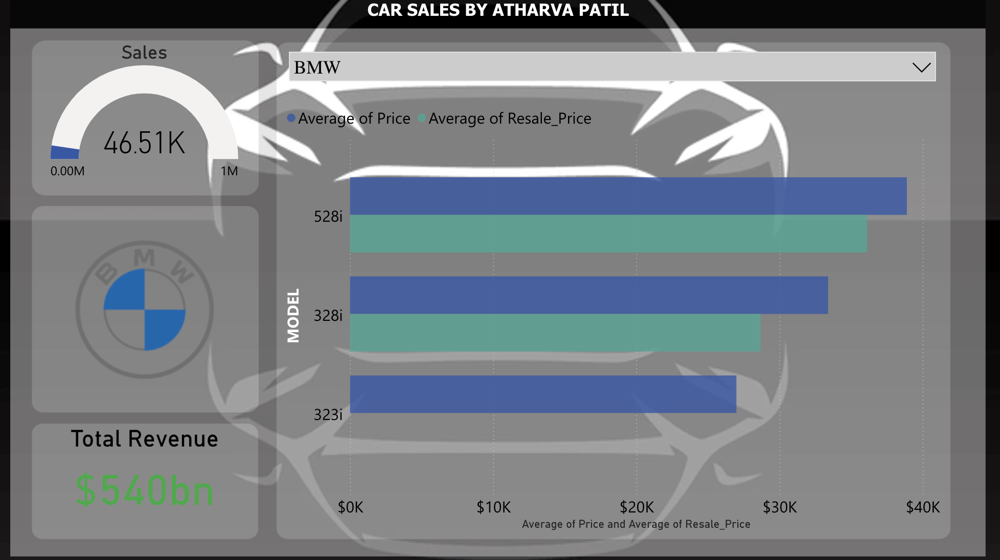
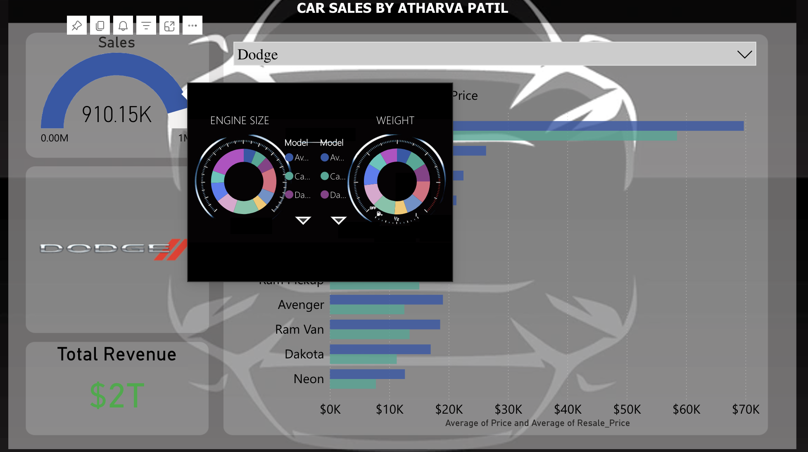
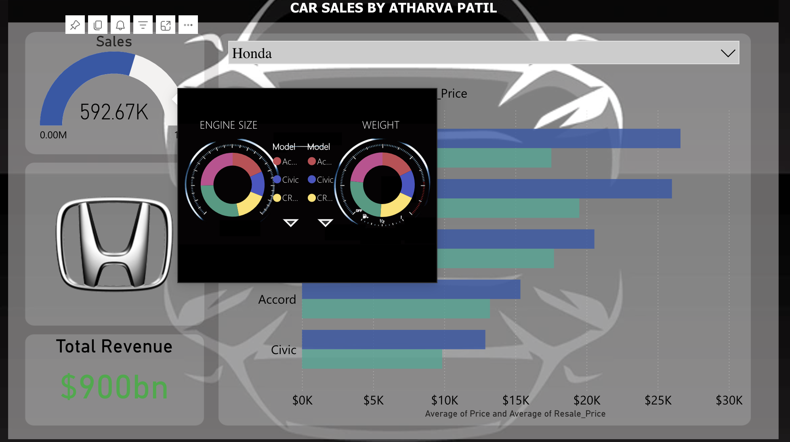
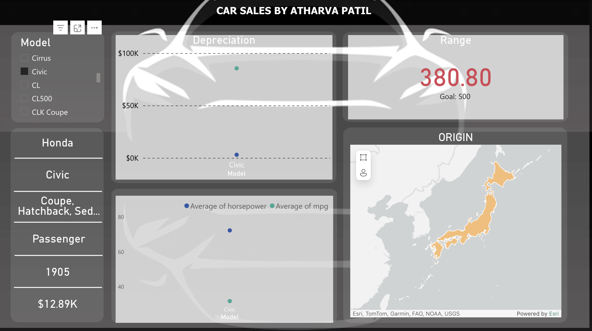
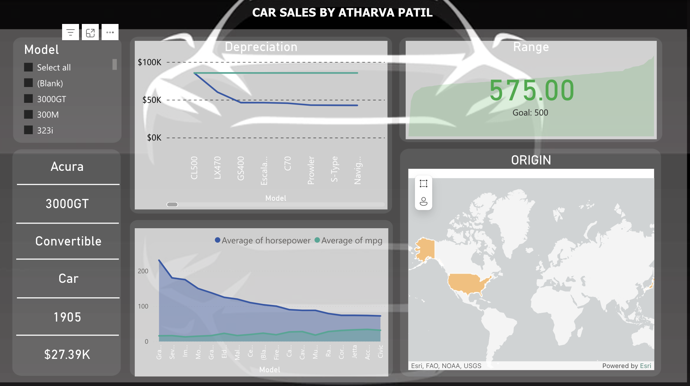
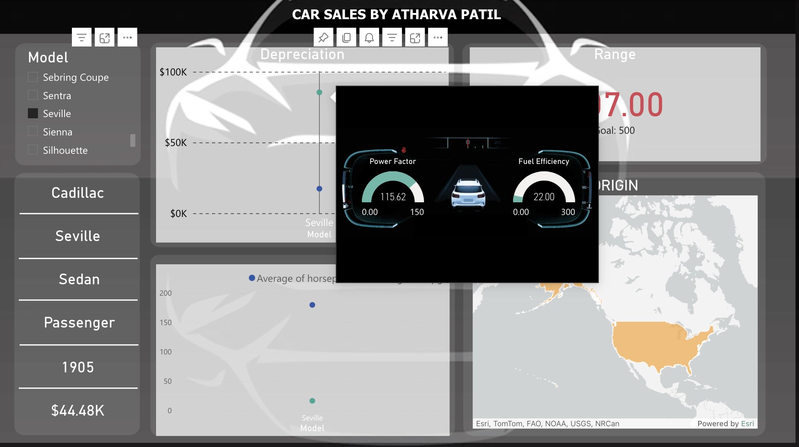
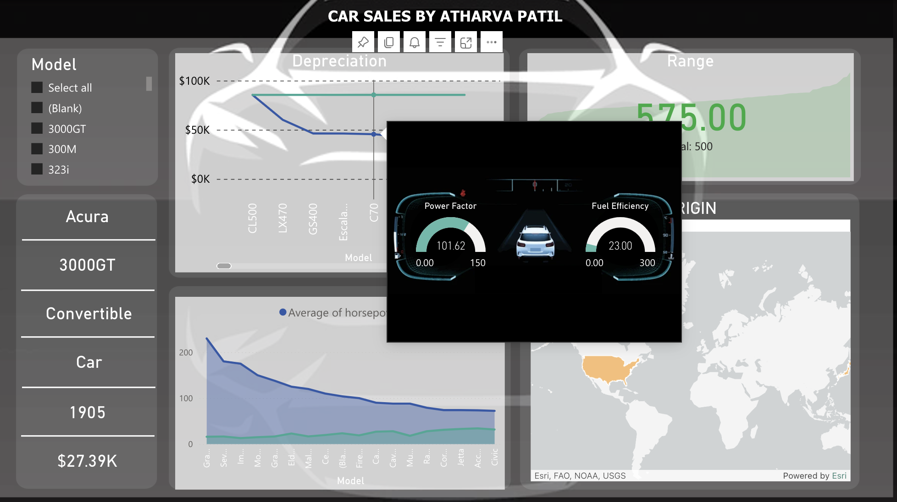

# Car Sales Dashboard in Power BI

This project is an interactive and visually appealing dashboard for car sales analysis. Built using Power BI, the dashboard integrates multiple datasets, custom visualizations, and various features to provide detailed insights into car features, sales trends, and manufacturer performance.

## Features
- **Datasets**: Utilized 4 car feature datasets from Kaggle.
- **Interactive Dashboard**: Offers a dynamic and engaging user experience with slicers, filters, and drill-down options.
- **Changing Car Brand Logos**: Automatically updates car brand logos based on the selected manufacturer.
- **Custom Visualizations**: Implemented unique visuals and graphs to enhance the presentation of data.
- **Graphs and Charts**: Includes a variety of graphs such as depreciation analysis, sales trends, and KPI indicators for total revenue.
- **Custom Tooltips**: Integrated informative tooltips to provide additional context when hovering over data points.
- **DAX Calculations**: Leveraged DAX functions for calculating outputs like total revenue, driving range, depreciation, etc.
- **Geographic Mapping**: Visualized origin countries for car models using map charts.
- **Multi-Page Layout**: Organized information across multiple pages to separate manufacturer and model details.
- **Custom Backgrounds**: Designed and applied unique background templates to maintain a consistent and professional theme.

## Visualizations
The dashboard includes:
- **Depreciation Graph**: Illustrates the value drop of car models over time.
- **Sales Trends**: Displays sales performance across different periods.
- **Total Revenue KPI**: Highlights the total revenue generated by each brand.
- **Car Feature Analysis**: Shows insights on horsepower, engine size, driving range, and more.

##Tools & Technologies Used**:
- Power BI
- DAX
- Custom Visuals
- Geographic Mapping
- Data Modeling

## How to Use
You can interact with the dashboard by:
- [View the Dashboard online here](https://app.powerbi.com/view?r=eyJrIjoiZGI3MjMxNzQtZWU3Mi00MTg0LTkzOWEtNGE1NTcxYzA0MjljIiwidCI6ImQxZjE0MzQ4LWYxYjUtNGEwOS1hYzk5LTdlYmYyMTNjYmM4MSIsImMiOjEwfQ%3D%3D)
- Selecting different car manufacturers to update logos and visualizations.
- Navigating through the pages to explore manufacturer-specific and model-specific details.
- Hovering over data points to reveal additional insights with custom tooltips.
- Filtering by car features like engine size, horsepower, and more to customize your analysis.

## Project Screenshots

### Interactive Manufacturer Page

  

### Tooltip for Manufacturer Page

  

  

### Interactive Model page

  

  

### tooltip for Model Page

  

  

## Conclusion

This project showcases advanced Power BI skills and creative data visualization techniques tailored to automotive sales analysis.

## References
- [link to dashboard](https://app.powerbi.com/view?r=eyJrIjoiZGI3MjMxNzQtZWU3Mi00MTg0LTkzOWEtNGE1NTcxYzA0MjljIiwidCI6ImQxZjE0MzQ4LWYxYjUtNGEwOS1hYzk5LTdlYmYyMTNjYmM4MSIsImMiOjEwfQ%3D%3D)
- Kaggle
